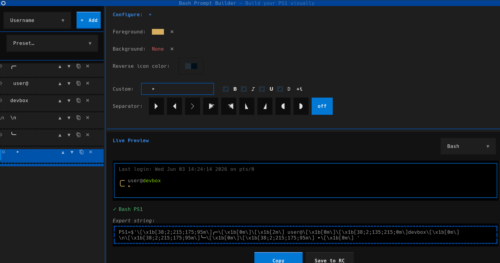

# Prompt Builder

Prompt Builder is a terminal application that allows you to visually design, preview, and export shell prompts for **Bash** and **Zsh**.

Instead of manually editing `PS1` or `PROMPT` variables, Prompt Builder provides an interactive interface for assembling prompt components, customizing colors and styles, and previewing the final result in real time.

## Demo



## Features

* Interactive prompt editor
* Bash (`PS1`) support
* Zsh (`PROMPT`) support
* Live prompt **preview**
* Color and style customization
* Multi-line prompt layouts
* Generate shell-ready prompt definitions

## Requirements

### Nerd Fonts (Required)

Prompt Builder requires a Nerd Font.

Many prompt presets and icons rely on Nerd Font glyphs. Without a Nerd Font installed, icons may appear as missing characters or placeholder symbols.

Download and install a Nerd Font from:

https://www.nerdfonts.com/

Simple install linux:

```sh
mkdir -p ~/.local/share/fonts
curl -fsSL https://github.com/ryanoasis/nerd-fonts/releases/latest/download/Hack.zip -o /tmp/Hack.zip
unzip -o /tmp/Hack.zip -d ~/.local/share/fonts/Hack
fc-cache -fv
```

### Supported Shells

* Bash
* Zsh

### Python

* Python 3.10+

## Installation

```bash
git clone <repository-url>
cd prompt-builder
pip install -e .
```

## Usage

Launch the application:

```bash
prompt-builder
```

Design your prompt interactively, then export the generated configuration to your shell startup file.

For Bash:

```bash
~/.bashrc
```

For Zsh:

```bash
~/.zshrc
```

## Example

A generated prompt might look like:

```text
┌── user@host
└─>
```

depending on the selected layout and icon set.

## Built With

Prompt Builder is built using Textual:

https://github.com/Textualize/textual

Textual provides a modern framework for building rich terminal user interfaces in Python.
